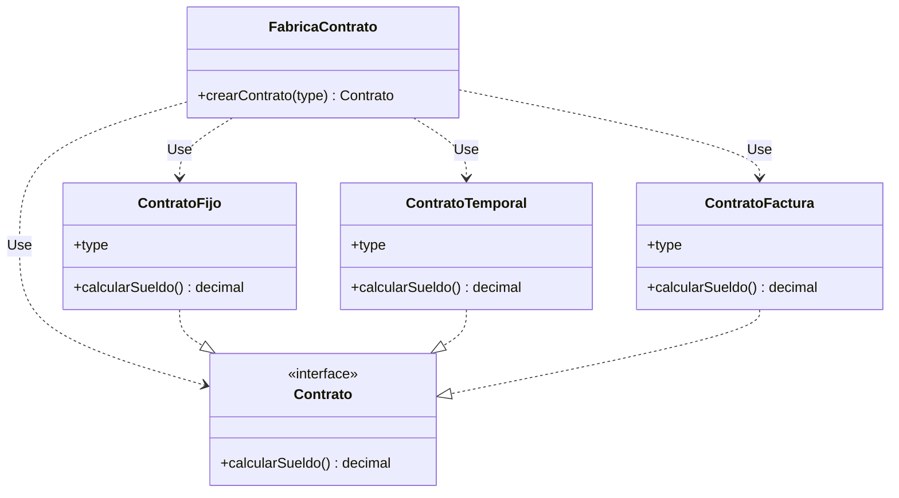

# De Factory Method a Simple Factory

El diagrama de `Factory.png` es un **Factory Method**: la creación está repartida en una jerarquía. `CreadorContrato` declara `crearContrato()` y cada subclase (`CreadorContratoFijo`, `CreadorContratoTemporal`, `CreadorContratoFactura`) instancia un contrato distinto.

Un **Simple Factory** concentra esa decisión en **una sola clase concreta**. El cliente pasa el tipo y la fábrica devuelve el `Contrato` que corresponde. No hay creadores que hereden entre sí.

## Qué se conserva

La familia de productos no cambia:

- `Contrato`, con `calcularSueldo(): decimal`
- `ContratoFijo`, `ContratoTemporal` y `ContratoFactura`, cada uno con `type` y su propia implementación de `calcularSueldo()`

## Qué se reemplaza

Desaparecen estas cuatro clases:

- `CreadorContrato`
- `CreadorContratoFijo`
- `CreadorContratoTemporal`
- `CreadorContratoFactura`

En su lugar queda una clase, `FabricaContrato`, con un único método `crearContrato(type): Contrato`. El campo `type` deja de vivir en cada creador y pasa a ser el argumento de ese método. Dentro hay un `switch` (o una cadena de `if`) que elige la clase concreta.

## Diagrama resultante



## Código

`Contrato`, `ContratoFijo`, `ContratoTemporal` y `ContratoFactura` se quedan como están. La fábrica nueva sería esta:

```java
package factory;

public class FabricaContrato {

    public Contrato crearContrato(String type) {
        switch (type) {
            case "FIJO":
                ContratoFijo fijo = new ContratoFijo();
                fijo.type = type;
                return fijo;
            case "TEMPORAL":
                ContratoTemporal temporal = new ContratoTemporal();
                temporal.type = type;
                return temporal;
            case "FACTURA":
                ContratoFactura factura = new ContratoFactura();
                factura.type = type;
                return factura;
            default:
                throw new IllegalArgumentException("Tipo de contrato no soportado: " + type);
        }
    }
}
```

El cliente ya no elige una subclase de creador. Elige un tipo y llama siempre al mismo objeto:

```java
package factory;

public class Main {
    public static void main(String[] args) {
        FabricaContrato fabrica = new FabricaContrato();

        Contrato fijo = fabrica.crearContrato("FIJO");
        Contrato temporal = fabrica.crearContrato("TEMPORAL");
        Contrato factura = fabrica.crearContrato("FACTURA");

        System.out.println(fijo.calcularSueldo());
        System.out.println(temporal.calcularSueldo());
        System.out.println(factura.calcularSueldo());
    }
}
```

## Comparación

| | Factory Method (diagrama actual) | Simple Factory |
|---|---|---|
| Quién crea | Cada subclase de `CreadorContrato` | `FabricaContrato` |
| Cómo se elige el producto | Instanciando el creador concreto | Pasando `type` al método |
| Clases de creación | 1 abstracta + 3 concretas | 1 concreta |
| Ampliar con un contrato nuevo | Nueva subclase de creador, sin tocar las demás | Nuevo `case` dentro de `crearContrato` |
| Productos | `Contrato` y sus tres implementaciones | Igual |

## Cuándo encaja

Simple Factory encaja cuando los tipos de contrato son pocos y conocidos, y la variación está en el producto (`calcularSueldo`), no en el proceso de creación. Factory Method compensa cuando cada forma de crear el contrato puede crecer por su cuenta y se quiere añadir un tipo nuevo sin modificar una clase ya existente.
